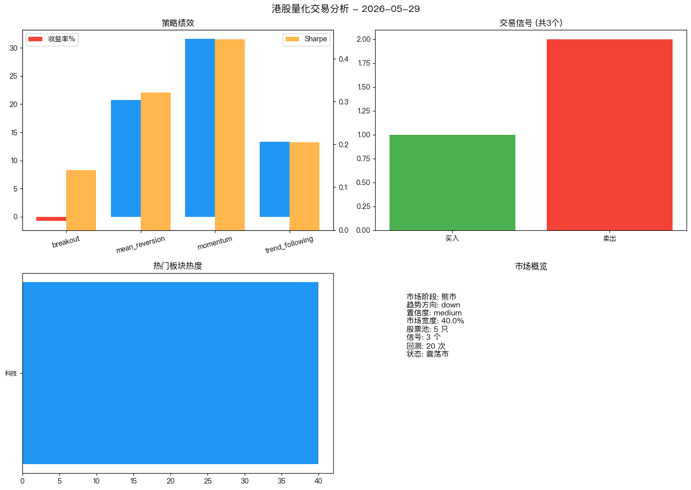
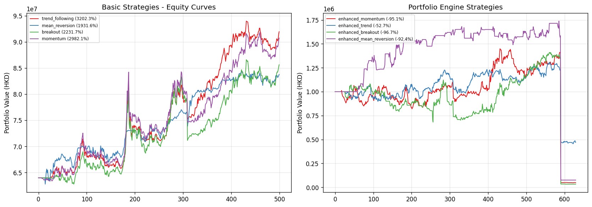

# 港股量化交易系统 (HK)

基于 **多智能体架构** 的港股每日动态机会点挖掘系统。

---

## 今日分析 (2026-05-29)

### 📊 策略绩效

| 策略 | 收益率 | Sharpe | 最大回撤 |
|------|--------|--------|---------|
| breakout | -0.74% | 0.140 | -37.92% |
| mean_reversion | +20.74% | 0.322 | -27.92% |
| momentum | **+31.60%** | **0.446** 🏆 | -33.16% |
| trend_following | +13.29% | 0.205 | -33.96% |

### 📊 市场研判

| 维度 | 判断 |
|------|------|
| 市场阶段 | 熊市 |
| 趋势方向 | down |
| RSI | 16.4 |
| 波动率(年化) | 24.0% |

**恒生指数**: 25006 点 | **市场宽度**: 40.0% 股票站上MA50

### ⚠️ 风险控制

| 指标 | 值 |
|------|-----|
| 当前回撤 | 0.00% |
| 状态 | normal |

### 📈 可视化



---

## 系统架构

```
新闻 ──→ 板块 ──→ 日线数据 ──→ 技术指标 ──→ 时间序列信号 ──→ RL决策 ──→ 报告/可视化/飞书
```

### ECC 架构增强

热点板块挖掘采用 **ECC（Everything Claude Code）** 架构模式：

#### COLLECT → ENRICH → STORE

```
COLLECT: fetch_all_parallel(market="hk")
         └── Yahoo Finance + AASTOCKS + 新浪 + 财联社  并行抓取，合并去重
ENRICH:  classify_sectors(texts, ...)
         └── 关键词 + 可选 Gemini LLM                  双通道板块分类
STORE:   SECTOR_STOCK_MAP_HK → hot_sectors              热度评分 + 成分股映射
```

| 改进维度 | 重构前 | 重构后（ECC） |
|----------|--------|--------------|
| 抓取方式 | 顺序轮询，停在第1个成功源 | 5 源并行，合并去重取最大覆盖 |
| 板块分类 | 正则关键词匹配 | 关键词 + 可选 Gemini LLM 双通道 |
| 缓存 | 无 | SHA-256 内容哈希 + 30 分钟 TTL |
| 自动化 | 手动运行 | GitHub Actions 定时（9:30/16:00 北京） |
| 共享代码 | 独立维护 | `scrapling_utils` 统一引擎 |

### Agent 管线

10 Agent 管线: HotSector → DataFetch → TSSignal → RL → MultiStrategy → Risk → Report → Viz → Feishu → Storage

## 快速开始

```bash
git clone https://github.com/luojiahuli/rl_trading_hk.git
cd rl_trading_hk
pip install -r requirements.txt
python main.py
```

### 每日推送

```bash
bash daily_push.sh
```

## 配置

| 变量 | 说明 | 默认值 |
|------|------|--------|
| `FEISHU_APP_ID` | 飞书应用 ID | 环境变量 `FEISHU_APP_ID` |
| `FEISHU_APP_SECRET` | 飞书应用 Secret | 环境变量 `FEISHU_APP_SECRET` |
| `FEISHU_CHAT_ID` | 飞书群 ID | 环境变量 `FEISHU_CHAT_ID` |
| `MIN_STOCK_PRICE` | 最低股价过滤 | HK$1.0 |
| `INITIAL_CASH` | 初始资金 | HK$1,000,000 |


## 回测表现
更新日期: 2026-05-30
初始资金: ¥1,000,000
数据范围: 2024-01-01 ~ 2026-05-30

### 基础策略 (逐只回测合计)
| 策略 | 总收益率 | Sharpe | 最大回撤 | 交易次数 |
|------|---------|--------|---------|---------|
| trend_following | +3202.35% | 0.62 | -28.63% | 1093 |
| momentum | +2982.05% | 0.54 | -31.08% | 1376 |
| breakout | +2231.68% | 0.51 | -31.46% | 648 |
| mean_reversion | +1931.63% | 0.76 | -23.59% | 1889 |

### 组合引擎 (集中投资+止损止盈)
| 策略 | 总收益率 | Sharpe | 最大回撤 | 交易次数 | 止损次数 | 止盈次数 |
|------|---------|--------|---------|---------|---------|---------|
| enhanced_trend | -52.70% | -0.31 | -65.23% | 212 | 32 | 31 |
| enhanced_mean_reversion | -92.41% | -0.28 | -95.64% | 49 | 16 | 4 |
| enhanced_momentum | -95.07% | -0.30 | -96.73% | 152 | 57 | 13 |
| enhanced_breakout | -96.67% | -0.31 | -97.64% | 119 | 34 | 27 |



详细数据: [/Users/mac13/workspace/rl_trading_hk/output/reports/equity_curves_20260530.csv](/Users/mac13/workspace/rl_trading_hk/output/reports/equity_curves_20260530.csv)
